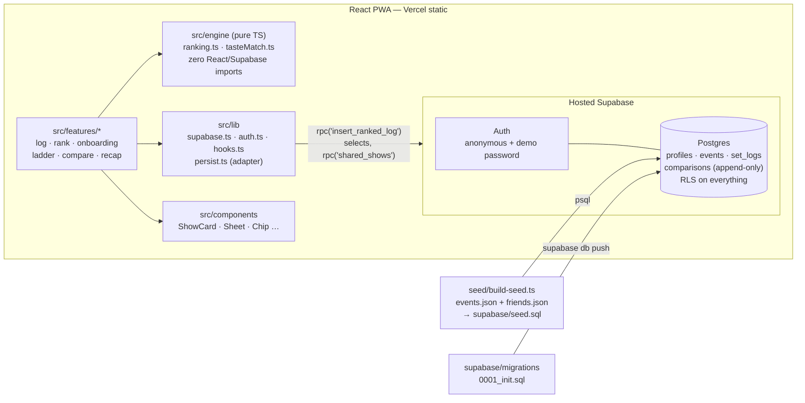

# Encore — MVP Architecture

This document is the build-truth for the 48-hour MVP described in [PRODUCT.md](./PRODUCT.md) §11.
It synthesizes four design workstreams (schema, engine, client, seed/demo) plus two cross-review
passes into one canonical contract. Where an original design note disagrees with this document,
**this document wins** (see [Appendix A](#appendix-a--resolved-design-conflicts) for what was
resolved and why).

Related: [README](../README.md) · [CONTRIBUTING](../CONTRIBUTING.md) · [DEMO runbook](./DEMO.md)

---

## 1. System overview

A Vite/React PWA talking directly to hosted Supabase (Postgres + auth) — no custom server. All
ranking math is a pure-TypeScript engine running in the client; Postgres stores the results and
the append-only comparison log that makes them recomputable.



Key stance: **the client is the ranking service**. Binary-insertion comparisons happen entirely
in memory (no network per tap); one atomic RPC persists the outcome. This is both the fastest UX
and the demo's network-failure insurance (§8, [DEMO.md](./DEMO.md)).

---

## 2. Data model (schema A, as amended)

Owner: W2, `supabase/migrations/0001_init.sql`. Core tables:

| Table                 | Purpose                    | Notable columns                                                                                           |
| --------------------- | -------------------------- | --------------------------------------------------------------------------------------------------------- |
| `profiles`            | 1:1 with `auth.users`      | `display_name`, `avatar_seed`, `tier_bounds jsonb`                                                        |
| `artists`             | canonical artists          | `genres text[]`, `aliases text[]`                                                                         |
| `venues`              | canonical NYC venues       | `capacity_tier` enum, `slug`, `neighborhood`, `capacity`, `borough`                                       |
| `events`              | artist(s) × venue × date   | `title`, `event_date`, `primary_genre`, `slug`; `event_artists` junction (billing_order 1 = headliner)    |
| `set_logs`            | a user's attendance + rank | `rank_pos` (1 = best), `latent_score`, `note`, `moment` enum, `crew uuid[]`; unique `(user_id, event_id)` |
| `comparisons`         | **append-only** tap log    | `subject_log`, `opponent_log`, `outcome` enum, `kind` enum, `session_id`                                  |
| `follows`             | asymmetric follow graph    | `(follower_id, followee_id)` PK                                                                           |
| `demo_ladder_fixture` | demo-reset snapshot        | service-role only                                                                                         |

RLS: everything readable by `authenticated` (public-ledger product; anonymous sign-ins get the
`authenticated` role too). Writes are owner-only (`auth.uid()` checks). `artists`/`venues`/
`events` have **no client write policies** — seed-only via service role.

Derived views `artist_ladder` and `venue_ladder` (avg `latent_score` per artist/venue,
`security_invoker`) exist in the schema but have no MVP UI (deferral §9).

### 2.1 Amendments to the original schema design, and why

1. **`create extension pgcrypto; create extension pg_trgm;` moved to the top of the migration.**
   The original DDL created the trigram index on `events.title` two lines _before_ creating
   `pg_trgm` — the migration would fail on first run.
2. **`comparisons.is_audit boolean` → `kind comparison_kind` enum
   (`'insertion' | 'audit' | 'backfill'`).** The engine assigns different K-factors per
   comparison kind on replay; a boolean cannot store three kinds. `session_id` kept (groups the
   3–5 taps of one insertion flow).
3. **`comparisons.subject_log` / `opponent_log`: nullable FKs to `set_logs` with
   `on delete set null` (not cascade).** The log must survive show deletion so full recomputation
   stays possible; replay ignores dangling ids. The original cascade-delete + append-only-rule
   combination was self-contradictory.
4. **Append-only enforcement via a `before update or delete` trigger that raises an exception**,
   not `create rule … do instead nothing`. Rules silently swallow writes (a debugging trap) and
   are effectively deprecated. Note honestly: the _real_ guarantee is the **absence of
   update/delete RLS policies** on `comparisons` — the trigger is belt-and-suspenders against
   service-role accidents.
5. **`profiles.tier_bounds jsonb` stores the engine's index-cut shape `{"cuts":[a,b,c,d]}`**, not
   score cutoffs. The engine owns tiers as ladder-index cuts computed from score gaps; storing
   score thresholds (the original `{"alltimer":1600,…}`) belonged to a different tier model and
   would mislabel a 1500-centered ladder. Client derives tier labels from cuts. (No localStorage
   variant — server is the single home.)
6. **`set_logs.latent_score` has no meaningful default.** The engine supplies all scores
   (1500-centered); a DB default of 1200 was a second, conflicting baseline.
7. **`slug text unique` (nullable) added to `events` and `venues`; `venues.neighborhood`,
   `venues.capacity`, `venues.borough` added (nullable).** Slugs are the seed pipeline's stable
   keys (deterministic `uuidv5(slug)` ids make re-seeding and demo reset idempotent); capacity
   feeds the comparison card's capacity chip; borough powers one recap-card stat.
8. **`events.primary_genre` is derived by the seed pipeline from the headliner's first genre
   tag** — one derivation rule, so `events.primary_genre` and `artists.genres[0]` cannot drift.
9. **`insert_ranked_log` RPC fully specified** (the original elided the body) — see §5.
10. **`demo_ladder_fixture` table added** (RLS enabled, zero policies ⇒ service-role only): the
    canonical pre-demo ladder snapshot that `seed/reset-demo.sql` restores.
11. **Dropped `users.is_seed`** — seeded accounts are identified by their fixed UUID prefix
    `00000000-0000-4000-a000-…`; no schema flag needed.

---

## 3. Ranking engine contract

Owner: W1, `src/engine/` — pure TS, zero React/Supabase imports, every behavior pinned by Vitest.

### 3.1 API (`src/engine/ranking.ts`)

```ts
startInsertion(userId, challenger, ladder): InsertionSession   // throws DuplicateShowError
getNextComparison(session): ComparisonPrompt | null            // null ⇒ done
recordChoice(session, 'challenger' | 'opponent' | 'too_different'): InsertionSession
finishInsertion(session): InsertionResult                      // { index, placement, ladder, comparisonsToAppend }

recomputeFromLog(userId, shows, log, boundaries?): Ladder      // deterministic replay
autoBucket(ladder) / dragBoundary(ladder, b, cut) / tierOf(ladder, i)
selectAuditComparison(ladder, recentLog) / applyAuditResult(…)
applyLens(ladder, { genre?, capacityTier?, year?, city? }): LensEntry[]
removeShow(ladder, showId) / startRerank(userId, showId, ladder)
```

All state is immutable and serializable — sessions survive React re-renders and are mirrored to
localStorage mid-flow. Taste match lives beside it in `src/engine/tasteMatch.ts` (§6).

### 3.2 Order is truth; scores are decoration

**The rank order produced by binary insertion is authoritative. Elo-style latent scores are
derived and may never reorder it.** The user just watched their show slot in at #6 after four gut
calls — if score math later silently moved it to #7, trust in the entire product dies. So:

- Binary search over `[lo, hi)`: pivot = `floor((lo+hi)/2)` (skipped pivots redraw outward:
  mid+1, mid−1, …). `challenger` wins → `hi = pivot`; `opponent` wins → `lo = pivot + 1`;
  `too_different` → pivot added to `skipped`, window unchanged. Done when `lo >= hi`; final index
  = `lo`. Tap bound: **≤ `ceil(log2(n+1))`** (9 taps at n=300, 4 at n=15).
- Scores: Bradley–Terry logistic Elo, `P(a beats b) = 1/(1 + 10^((Sb−Sa)/400))`. New-ladder
  baseline **1500**; new show starts at the midpoint of its neighbors. K = 64 for
  insertion/backfill (few, high-signal taps), K = 24 for audits. `too_different` is logged but
  never scored.
- **Monotonic repair sweep** after every insert: top→bottom, if `score[j+1] >= score[j] − ε`, set
  `score[j+1] = score[j] − SPACING` (SPACING = 32). This makes score order always agree with rank
  order, doubling as float-noise spacing enforcement. Scores exist to size tier gaps, pick audit
  pairs, and feel like "latent quality" — not to overrule taps.
- All comparisons skipped → the show lands at the bottom of the final window with
  `placement: 'provisional'` (rendered with a "~" badge; re-rankable later).
- **No iterative Bradley–Terry MM fit anywhere.** Closed-form updates + repair are sufficient at
  this scale and, critically, cannot contradict the watched placement.

### 3.3 Recomputability

`comparisons` is a deterministic transcript: replaying recorded outcomes through the same
binary-search state machine reproduces every index, then Elo updates (same K per `kind`) + repair
reproduce every score. `recomputeFromLog` is tested to be byte-identical with incremental
insertion — the append-only log means model upgrades are a constant change + replay, never data
loss.

### 3.4 Tiers

`autoBucket` places the four cuts at the four largest adjacent score gaps (each tier
≥ `ceil(n/20)` entries at n ≥ 10; fixed quantile cuts below that). Stored per-user as
`profiles.tier_bounds = {"cuts":[a,b,c,d]}`. `dragBoundary` exists and is tested, but the MVP UI
shows auto-buckets read-only (deferral §9).

---

## 4. Persistence flow

Owner boundary: W1 engine vocabulary meets W2 schema vocabulary in exactly one file —
**`src/lib/persist.ts`** (shared platform).

```
RankFlow screen                     engine (in memory)              Postgres
     │  tap ──────────────▶ recordChoice(session, outcome)              │
     │  (3–5 taps, zero network; session mirrored to localStorage)      │
     │  done ─────────────▶ finishInsertion(session)                    │
     │                          │ { index, ladder, comparisonsToAppend }│
     │  optimistic cache update (slot-in animation plays NOW)           │
     │  persistRankedLog(…) ────┴──── rpc('insert_ranked_log') ────────▶│  one atomic tx
```

- **No per-tap inserts.** The session buffers comparisons; the challenger's `set_logs` row (which
  `comparisons.subject_log` references) doesn't exist until finalize, so per-tap fire-and-forget
  was structurally impossible anyway.
- The adapter maps engine → schema vocabulary 1:1: `challenger/opponent` →
  `subject_log/opponent_log`; outcome `challenger/opponent/too_different` →
  `a_wins/b_wins/skipped`; `kind` passes through to `comparison_kind`.
- **`insert_ranked_log`** — plpgsql, `security invoker` (RLS applies), signature
  `(p_event_id uuid, p_score double precision, p_rank int, p_session_id uuid, p_comparisons
jsonb, p_score_updates jsonb) returns set_logs`. Body, in order:
  1. `update set_logs set rank_pos = rank_pos + 1 where user_id = auth.uid() and rank_pos >= p_rank`
     (shift first — `rank_pos` has no unique constraint, so a transient duplicate would be
     harmless, but shifting first avoids it entirely);
  2. insert the new `set_logs` row, capturing `new_id`;
  3. insert `comparisons` rows from `p_comparisons`, with `subject_log = new_id` and the scalar
     `p_session_id` (session id is passed once, not per row);
  4. apply `p_score_updates` (neighbor repair deltas) guarded by `user_id = auth.uid()`;
  5. return the new row.
- **Optimistic-first for demo resilience (P1-4):** the Query-cache ladder update is applied
  unconditionally _before_ the RPC; the RPC fires in the background with retry
  (`flushPendingLogs()` re-fires stranded writes on next boot). The slot-in animation, ladder,
  and Compare screens all work off cache even if the write is still pending.
- Enrichment (note / moment / crew) is a plain owner-RLS `update` on `set_logs` — not part of the
  atomic path.

---

## 5. Taste match

Owner: W1, **`src/engine/tasteMatch.ts`** (engine, not lib — it's pure math and Vitest covers
`src/engine/**`).

**Formula (canonical):** recency-weighted Spearman-style correlation on the shared subset.

1. Shared set S = events both users logged. `|S| < MIN_OVERLAP (5)` → return `null` (UI shows
   "Not enough shared shows yet"). Spearman under n=5 is noise.
2. **Re-rank both sides 1..n within the subset** (full-ladder positions are not
   translation-safe; both vectors must be subset-dense before correlating — `useCompare`
   re-ranks before calling `tasteMatch`).
3. Weight per shared show: `w = 0.5 ^ (monthsAgo(event_date) / 18)` — **18-month half-life**.
4. ρ_w = weighted Pearson correlation of the two rank vectors; **match = round(50·(1+ρ_w))**,
   clamped 0–100.
5. Disagreement callout = the pair with the largest |subset-rank delta|.
6. Time is injected: every function takes `now: Date`; fixtures/tests pin **2026-07-18**.

### 5.1 Worked fixture — the 87%

Demo user Andrew (15 shows) × seeded friend Maya (32 shows) share 12 shows pre-demo. Subset
re-ranks (Andrew's from the §7.1 ladder order; Maya's pinned in `seed/friends.json`):

| Shared show                       | Date       | Andrew |  Maya |   d |  d² |
| --------------------------------- | ---------- | -----: | ----: | --: | --: |
| Rüfüs Du Sol @ MSG                | 2025-10-17 |      1 |     1 |   0 |   0 |
| Anyma @ Brooklyn Mirage           | 2025-08-23 |      2 |     2 |   0 |   0 |
| **Four Tet @ Under the K Bridge** | 2026-06-06 |  **3** | **9** |  −6 |  36 |
| Bicep @ Knockdown Center          | 2025-11-14 |      4 |     3 |   1 |   1 |
| Lane 8 @ Brooklyn Mirage          | 2025-09-05 |      5 |     4 |   1 |   1 |
| Jamie xx @ Forest Hills           | 2025-09-27 |      6 |     6 |   0 |   0 |
| Peggy Gou @ Great Hall            | 2026-02-14 |      7 |     7 |   0 |   0 |
| Fontaines D.C. @ Brooklyn Steel   | 2025-11-21 |      8 |     5 |   3 |   9 |
| Charli XCX @ Barclays             | 2025-10-04 |      9 |    12 |  −3 |   9 |
| DJ Koze @ Nowadays                | 2026-04-18 |     10 |    10 |   0 |   0 |
| Sammy Virji @ Webster Hall        | 2025-12-05 |     11 |     8 |   3 |   9 |
| Helena Hauff @ Basement           | 2025-12-12 |     12 |    11 |   1 |   1 |

(Maya's subset order follows her full-ladder positions pinned in `seed/friends.json`: Bicep #3,
Lane 8 #4, Fontaines #5, Jamie xx #8, Peggy #11, Sammy #14, Four Tet #21, Koze #24, Helena #26,
Charli #29.) Unweighted, Σd² = 66 → plain Spearman ρ = 1 − 6·66/(12·143) = 0.769 → would round
to 88. But the recency weights (2026-07-18 anchor, 18-month half-life: Four Tet w≈0.95, DJ Koze
w≈0.89, Peggy w≈0.82 vs ≈0.66–0.76 for the 2025 shows) load the freshest disagreements hardest:
**ρ_w = 0.7373 → match = round(50 × 1.7373) = 87.** ✓

**Post-log invariance:** Fred again.. @ Forest Hills (2026-07-11) enters at Andrew subset
position 6 (ladder #6, §7.2) and Maya subset position 6 — she has Fred at her full-ladder **#6**,
with Rüfüs, Anyma, Bicep, Lane 8, and Fontaines among shared shows above it. Fred contributes
delta 0 at near-full weight (w≈0.99); Four Tet's delta stretches to −7 (subset 3 vs 10). n=13,
ρ_w = 0.7304 → **still 87**. A Vitest test asserts `tasteMatch(fixture) === 87` both pre- and
post-log, so seed edits cannot silently break the money number.

The scripted "violent disagreement" beat cites **Four Tet** only (Andrew #3 all-time, Maya
full-ladder #21 / subset 9 pre, 10 post), with Maya's seeded note on that log — _"Left before the encore."_ —
displayed in head-to-head. Second friend Dex (techno purist, 7 shared shows, rank-scrambled)
lands ≈62%, proving the number discriminates.

---

## 6. Client architecture

Stack (pinned): Vite 6 + `@vitejs/plugin-react` · TypeScript 5 strict · **Tailwind v4 via
`@tailwindcss/vite`** (no postcss/tailwind config files — tokens live in `@theme` in
`src/styles/index.css`) · framer-motion 11 · TanStack Query 5 · supabase-js 2 ·
react-router-dom 7 · vite-plugin-pwa · Inter variable (self-hosted) · vitest (node env, covers
`src/engine/**`) · eslint flat + typescript-eslint · prettier.

### 6.1 Module map (= ownership map, see [CONTRIBUTING.md](../CONTRIBUTING.md))

| Path                                                                        | Workstream | Contents                                                                                     |
| --------------------------------------------------------------------------- | ---------- | -------------------------------------------------------------------------------------------- |
| `src/engine/**`                                                             | W1         | Pure-TS ranking + taste match. Zero React/Supabase imports.                                  |
| `supabase/**`, `seed/**`                                                    | W2         | Migration, RLS, RPCs, views; seed pipeline + demo reset.                                     |
| `src/features/log`, `…/rank`, `…/onboarding`                                | W3         | Event search → log; pairwise flow + slot-in animation; name picker + 5-best backfill.        |
| `src/features/ladder`, `…/compare`, `…/recap`                               | W4         | Tiered ladder + lenses + enrichment sheet; taste match + head-to-head; recap card (stretch). |
| `src/lib`, `src/components`, `src/App.tsx`, root configs, `.github`, `docs` | shared     | Platform: supabase client, auth, hooks, persist adapter, UI primitives, shell/routing.       |

**The isolation rule:** feature code never imports from another feature folder — only
`@/engine`, `@/lib`, `@/components`. Shared needs move _down_ into lib/components, never
sideways.

### 6.2 Routes (`src/App.tsx` owns the table; features export one lazy default each)

| Route                 | Entry                                  | Shell                                                                                                       |
| --------------------- | -------------------------------------- | ----------------------------------------------------------------------------------------------------------- |
| `/welcome`            | `features/onboarding/OnboardingScreen` | fullscreen (name picker + backfill; guard: profile + non-empty ladder → skip; always offers "Skip for now") |
| `/`                   | `features/ladder/LadderScreen`         | tab bar                                                                                                     |
| `/log`                | `features/log/LogScreen`               | tab bar                                                                                                     |
| `/rank/:eventId`      | `features/rank/RankFlowScreen`         | fullscreen (the centerpiece)                                                                                |
| `/compare/:friendId?` | `features/compare/CompareScreen`       | tab bar (no id → friends list)                                                                              |
| `/recap`              | `features/recap/RecapScreen`           | tab bar (stretch, URL-only)                                                                                 |

An `AuthGate` layout route blocks render until `ensureSession()` resolves (anonymous sign-in, or
`signInWithPassword` when `?as=demo` is present), redirects to `/welcome` when no profile row
exists, then pre-warms the demo-critical queries and retries stranded log writes.

### 6.3 Data layer

- `src/lib/supabase.ts`: typed client over generated `database.types.ts` (`npm run gen:types`;
  a hand-written placeholder is committed until W2's schema lands).
- TanStack Query is the only server-state store; no Redux/Zustand. Query keys centralized.
- Ladder read is **one query** (`set_logs` + joined `events`/`venues`/`event_artists`, ordered by
  `rank_pos`); lenses filter the cached ladder client-side via `applyLens`.
- Event search: `.ilike('title', %q%)` (titles are composed as "Artist at Venue" by the seed, and
  trigram-indexed).
- Compare: `rpc('shared_shows', …)` returns the joined subset; the client subset-re-ranks and
  runs `tasteMatch`.
- Mid-flow insertion state lives in React state mirrored to localStorage (a refresh mid-demo
  cannot lose taps).
- New users auto-follow the two seeded friends client-side on profile creation — the Compare tab
  is never empty for a judge's fresh anonymous session.

### 6.4 Animation approach (the money shot)

Framer-motion, one shared spring config (`src/lib/motion.ts`). RankFlow wraps both phases in
`LayoutGroup` + `AnimatePresence`:

- **Comparison phase:** two stacked cards (thumb-reachable), `layoutId` per show. Tap → chosen
  card scales up with a glow, loser dims; the challenger card keeps its `layoutId` across pairs
  so it reads as _your show advancing through a gauntlet_. Progress dots track the ≤4 taps.
  Card fields: artist (large), venue + capacity chip, date ("Oct '25"), genre chip; challenger
  gets a subtle "NEW" badge; **never scores or ranks mid-flow** (would bias taps and spoil the
  reveal).
- **Slot-in phase:** the challenger card FLIPs (shared layout) from center stage into the ladder;
  rows below spring downward; the new row enters with a scale/highlight pulse; the rank badge
  counts to **#6**. ~1.8 s total.

Styling: dark-only concert aesthetic — bg `#0B0B10` ("venue black"), violet→magenta accent
gradient (stage light), tier colors as left-edge bars (gold / violet / sky / slate / dried-blood
red), Inter variable, 390px mobile-first. PWA manifest: name "Encore", theme `#0B0B10`,
standalone; **no service-worker data caching** (stale cache at demo time is a worse failure than
no cache).

---

## 7. Seed & demo choreography

Owner: W2, `seed/`. JSON-first: `events.json` (~200 real NYC shows Jul '25–Jul '26; ~40
demo-load-bearing rows hand-pinned, the rest LLM-drafted and validated), `venues.json` (~24
venues, all capacity tiers), `friends.json` (Maya + Dex ladders as ordered slug lists),
`demo-user.json` (Andrew's 15-show ladder). `build-seed.ts` validates (venue exists, genre in
closed vocab, date in range, capacity↔tier consistency) and emits `supabase/seed.sql` with
**deterministic `uuidv5(slug)` ids** — re-seeding is idempotent, and `reset-demo.sql` can
hardcode UUID literals.

Seeded accounts (fixed UUID prefix `00000000-0000-4000-a000-…`): Andrew (demo user, 15 shows,
**password credential** `demo@encore.app` — see README), Maya (32 shows, the 87%), Dex (26 shows,
~62%). Seeds include plausible per-insertion `comparisons` transcripts so the append-only log is
real enough to recompute.

### 7.1 Andrew's start-state ladder (pre-demo)

1 Rüfüs Du Sol @ MSG · 2 Anyma @ Brooklyn Mirage · 3 Four Tet @ Under the K Bridge · 4 Bicep @
Knockdown Center · 5 Lane 8 @ Brooklyn Mirage · 6 Jamie xx @ Forest Hills · 7 Peggy Gou @ Great
Hall · 8 Fontaines D.C. @ Brooklyn Steel · 9 Charli XCX @ Barclays · 10 Jungle @ Brooklyn
Paramount · 11 DJ Koze @ Nowadays · 12 Sammy Virji @ Webster Hall · 13 Kaytranada @ Radio City ·
14 MJ Lenderman @ Bowery Ballroom · 15 Helena Hauff @ Basement

### 7.2 The live log — verified pivot sequence

**Fred again.. @ Forest Hills Stadium, Jul 11 2026** ("last weekend" at the pinned 2026-07-18
demo date; searchable by typing "fred"). Binary search over n=15, 0-based window `[lo,hi)` =
`[0,15)`, pivot = `floor((lo+hi)/2)`:

| Tap | Pivot index | Opponent (rank)     | Presenter taps | Window after   |
| --- | ----------- | ------------------- | -------------- | -------------- |
| 1   | **7**       | Fontaines D.C. (#8) | Fred better    | `[0,7)`        |
| 2   | **3**       | Bicep (#4)          | Bicep better   | `[4,7)`        |
| 3   | **5**       | Jamie xx (#6)       | Fred better    | `[4,5)`        |
| 4   | **4**       | Lane 8 (#5)         | Lane 8 better  | `[5,5)` → done |

`lo = hi = 5` → index 5 → **rank #6**, tier "Great". Exactly 4 taps, fully deterministic given
those answers — verified against the engine state machine, and the seed pins these four
opponents. Post-log, Compare with Maya still reads **87%** (§5.1).

### 7.3 Reset procedure

`npm run demo:reset` → `psql "$SUPABASE_DB_URL" -f seed/reset-demo.sql`, which (idempotent,
hardcoded UUIDs):

1. deletes Andrew's Fred `set_logs` row and any comparisons newer than the seed timestamp;
2. restores canonical `rank_pos`/`latent_score` for all 15 rows from `demo_ladder_fixture`.

Then reload the app (drop the Query cache). Full pre-demo checklist in [DEMO.md](./DEMO.md).

---

## 8. Ops

- **Hosted Supabase only — no Docker.** Bootstrap: create a project, `supabase link
--project-ref …`, `npm run db:push` (applies `supabase/migrations`), `npm run db:seed`
  (runs `build-seed.ts` then `psql "$SUPABASE_DB_URL" -f supabase/seed.sql`).
- **Dashboard step (one-time):** Authentication → Providers → **enable Anonymous sign-ins**;
  disable captcha. Without this, `signInAnonymously()` 422s in hour 1.
- **Env contract:** `.env.local` (gitignored) — `VITE_SUPABASE_URL`, `VITE_SUPABASE_ANON_KEY`
  (client, VITE_-prefixed = bundled), `SUPABASE_DB_URL` (server-side scripts only, never
  bundled). `.env.example` is committed with comments. No service-role key in the repo, ever.
- **Types:** `src/lib/database.types.ts` is generated (`npm run gen:types` = `supabase gen types
typescript --linked`); the committed file is a marked placeholder until regenerated.
- **Deploy:** Vercel static build; `vercel.json` rewrites all paths → `/index.html` so
  `/rank/:eventId` deep links survive refresh.
- **Tests/CI:** `vitest run` covers `src/engine/**` (insertion determinism, replay identity,
  monotonic repair, tier bucketing, the 87% fixture). CI gates every PR: `npm ci`,
  `tsc --noEmit`, `vitest run`, `vite build`, plus a seed build when `seed/**`/`supabase/**`
  changed.

---

## 9. Explicit deferrals (designed, not surfaced)

| Deferred                                          | State                                                                                                                                                                            |
| ------------------------------------------------- | -------------------------------------------------------------------------------------------------------------------------------------------------------------------------------- |
| Tier-boundary dragging UI                         | Engine keeps `dragBoundary` + tests; ladder shows auto-buckets read-only. Nothing in the 3-min script drags a boundary.                                                          |
| Audit comparisons in UI                           | Engine keeps `selectAuditComparison`; never triggered in MVP (a surprise extra comparison mid-demo is a risk, not a feature). Post-MVP: at most one per session on Ladder mount. |
| Crew tagging                                      | Disabled chip labeled "soon"; `set_logs.crew` column exists.                                                                                                                     |
| City lens                                         | Plumbed through `applyLens` but hidden — NYC-only seed makes it vestigial.                                                                                                       |
| Artist/venue ladder manual adjustment             | Views exist; read-only, no UI.                                                                                                                                                   |
| Feed screen                                       | Schema already serves it (`set_logs.created_at` × `follows`); no UI.                                                                                                             |
| Photos, real event APIs, offline sync, moderation | Skipped per PRODUCT.md §11.                                                                                                                                                      |

---

## Appendix A — Resolved design conflicts

The four design workstreams disagreed in ten places; consistency review found them, and these
resolutions are binding. Recorded so nobody "fixes" the code back toward a dead design.

| #   | Conflict                                                                                                                                                                                      | Resolution                                                                                                                                                                                   |
| --- | --------------------------------------------------------------------------------------------------------------------------------------------------------------------------------------------- | -------------------------------------------------------------------------------------------------------------------------------------------------------------------------------------------- |
| 1   | **Two ranking engines**: engine design said order-is-truth closed-form Elo; client design said iterative Bradley–Terry MM fit with rank = score order (could contradict the watched slot-in). | Engine design wins wholesale. `src/engine/ranking.ts` is the only engine; `bradleyTerry.ts` MM fit deleted; client hooks are thin callers.                                                   |
| 2   | **Per-tap comparison inserts** (client) vs `subject_log` FK requiring a not-yet-existing row (schema).                                                                                        | Buffer in session, persist atomically via `insert_ranked_log` at finalize. No per-tap network.                                                                                               |
| 3   | **Seed SQL targeted a different schema** (single `artist_id` on events, `position`/`score` columns, `users.is_seed`).                                                                         | Schema DDL is authoritative; `build-seed.ts` emits conformant SQL (`event_artists` junction, `rank_pos`/`latent_score`, composed `title`); `is_seed` dropped for UUID-prefix identification. |
| 4   | **The 87% fixture contradicted its own demo ladder** (would compute 93%).                                                                                                                     | Fixture regenerated against the actual ladder (§5.1), weighted formula verified to 87 pre- and post-log, pinned by a Vitest test. Demo copy cites Four Tet only.                             |
| 5   | **Comparison vocabulary drift**: `a_wins/b_wins/skipped` + `is_audit` boolean vs `challenger/opponent/too_different` + three-valued `kind`.                                                   | Schema gets `kind comparison_kind` enum; the 1:1 vocabulary mapping lives only in `src/lib/persist.ts`.                                                                                      |
| 6   | **Baseline 1200 + score-cutoff tiers** (schema) vs **1500 + index-cut tiers** (engine) vs localStorage tiers (client).                                                                        | Engine owns tiers: 1500 baseline, `{"cuts":[…]}` jsonb on `profiles.tier_bounds`, no localStorage variant, no meaningful score default.                                                      |
| 7   | **Cascade-delete FKs on an append-only log** (self-contradictory).                                                                                                                            | `on delete set null`; replay ignores dangling ids; trigger (not rules) blocks update/delete.                                                                                                 |
| 8   | **Taste-match half-life 12 vs 18 months**, module path `lib` vs `engine`.                                                                                                                     | 18 months (the 87% depends on it); `src/engine/tasteMatch.ts`; MIN_OVERLAP 5; disagreement = max delta.                                                                                      |
| 9   | **Column-name drift** (`rank`/`position` vs `rank_pos`; `score` vs `latent_score`; search on undefined `search_text`).                                                                        | `rank_pos` / `latent_score` / `.ilike('title', …)` everywhere.                                                                                                                               |
| 10  | **Tap-bound formula** `ceil(log2 n)+1` vs `ceil(log2(n+1))`.                                                                                                                                  | `ceil(log2(n+1))` (correct: 9 at 300).                                                                                                                                                       |

Also settled by decree: hosted Supabase over local Docker; demo identity via seeded password
credential + `?as=demo` (anonymous auth mints a fresh uid per browser, which would orphan the
seeded ladder); moment-tag chips map 1:1 to the enum strings via a shared map in
`src/engine/types.ts`; time injected as a `now` parameter everywhere (demo date pinned
2026-07-18).
